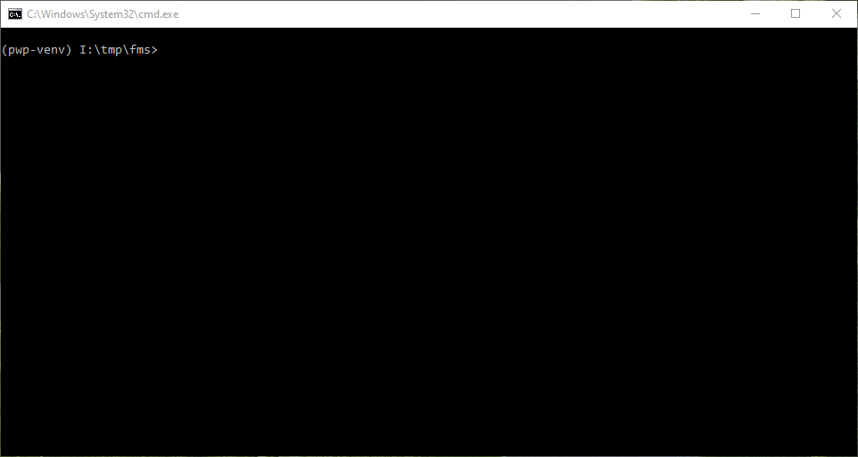
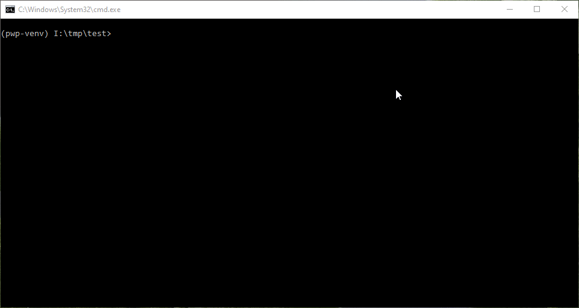

# PWP SPRING 2022

# Flight Booking Management System
You want to find and book a flight easily via API service? Good, because this WEB API provides a service that allows its clients to search for a flight and buy their desired ticket easily. To search for flights, clients create an offer request. An offer request describes the clients' conditions and where and when they want to travel. The API will send the search criteria to a range of airlines and come back to clients with a series of offers. Each offer represents a bundle of flights which clients can buy from a specific airline at a particular price that meets clients' search criteria. Once clients choose an offer, API creates an order with the respective airline by passing over the required information about each client (for example their name and date of birth), and payment information to the airline. For more specific information, refer to the wiki page of the repo.

## How to Set up the Repo

### Cloning
First you need to clone the repo. The following command shows you how to do it:
```
git clone https://github.com/Cyrus-Rock/PWP.git
```
After cloning, you need to enter the cloned directory. The following shows you how:
```
cd PWP
```

You are now in the main directory of the project. We also need to install the project as a package so we could use it in our local machine. The following shows you how to do this:

```
python -m pip install -e .
```

Now, we need to create and populate a default database for this project. The following subsections describe the steps required for the task.

## Construction of the Database and Its Population with Default Values
We need to create the actual database and fill it with some default values in order to work with it. To create the actual database, we need to , first, go to the location for the database's codes. Remember that now, we are in the main directory of the project. We need the following command to change to the desired directory:
```
cd ./fms/db/utilities
```

Now, we need the following commands to create and populate the default database:
```
python populate_db.py
cd ../..
```

After the execution of these commands is done, we'll be able to see `db.db` file in the current directory by issuing the command:

```
ls
```

In order to see the contents of the database, you need sqlite3 installed in your machine. Assuming you have it installed, you could enter the next command to open the database:

```
sqlite3 db.db
```

Now, in order to see the schema of the database, we enter the following code in the sqlite3's command prompt:

```
.schema
```

The result shows us the architecture and design of our tables in the database based on the diagrams provided in the wiki page.

We could also see the values in the tables from the database by issuing SQL queries. For example, the next command shows how we could see all the records in the flight table:

```
SELECT * FROM flight;
```

The result shows the default values that are provided by the python code. Feel free to check other default values for the other tables as well.

The following shows the whole process in action:



That's all for creating and populating the database.

## Testing

### Testing Database's Design and Utility Functions
In order to test that we have implemented the database according to the architecture that is presented in the wiki page, we have provided sophisticated tests that ensure the integrity of the design. These tests assure ACID properties and compliance in database's design.

We also have provided some utility functions that are required to create the database and populate it with default values. The provided tests make sure that these utility functions are intact and behave as the way that is explained in the documentation of each test.

### Testing API Resources
The database is not the only thing with robust tests. We have also put effort to implement sophisticated tests for the resources too. These tests ensure that all of the methods that are responsible for the resources behave the way they are expected. We bore in mind every nook and cranny of these resources when we were designing and implementing the tests. Some of the API resources were even implemented in TDD manner.


## How to Run the Tests
In order to run the tests, we need to do the following:
Remember that we need to be in the test directory. Now, execute the following command from the main directory of the project:

```
cd test
```

Now, we are in the test directory for the database and API resources. Now, we want to run the tests. The next command executes the tests:

```
python -m pytest
```

By running the preceding command, all the tests written for checking the correctness of database and API resources will execute, and the result is visible in the terminal.

We could also issue the following command to see the coverage of the tests:

```
python -m pytest --cov .
```

The following shows the coverage test in action:



That's all for the tests.

## How to see the API documentation
After running the server with the following command from the `fms` directory:
```
python -m flask run
```
We could see the API documentation by browsing `localhost:5000/apidocs/`.

The following is the visual depiction of the process:


# Group information
* Student 1. Alireza Bakhshi Zadi Mahmoodi (Alireza(dot)BakhshiZadiMahmoodi(at)student(dot)oulu(dot)fi)
* Student 2. Valtteri Kuosmanen (vkuosman(at)student(dot)oulu(dot)fi)
* Student 3. Ali Heikal (Ali(dot)Heikal(at)student(dot)oulu(dot)fi)
* Student 4. Name and email 

__Remember to include all required documentation and HOWTOs, including how to create and populate the database, how to run and test the API, the url to the entrypoint and instructions on how to setup and run the client__


